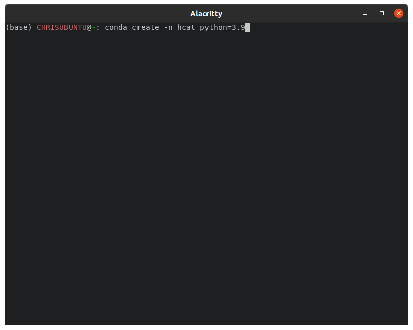
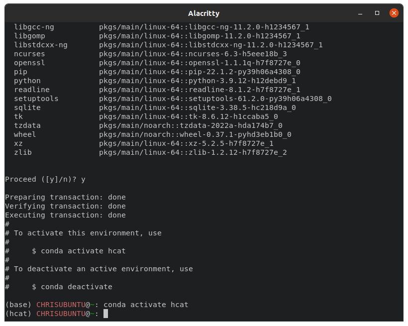

# HCAT - Hair Cell Analysis Toolbox

Hcat is a suite of machine learning enabled algorithms for performing common image analyses in the hearing field.
At present, it performs two fully automated analyses: (1) 2D hair cell detection (2) Volumetric hair cell segmentation. 


This tool is capable of automatically generating cochleograms, determine cell fluorescent intensity statistics, and
investigating tonotopic and morphological trends. 

---
## Quickstart Guide
#### Installation
* Install [Anaconda](https://www.anaconda.com/)
* In a terminal or anaconda prompt, copy and paste: `conda create -yn hcat python=3.9'
* Then copy and paste: t 'conda activate hcat`
* Install pytorch for CPU ONLY: `conda install pytorch torchvision torchaudio cpuonly -c pytorch`
* Install hcat dependencies: `pip install hcat`
* Run hcat: `conda activate hcat; hcat`

> NOTE: It is strongly recommended you follow the installation guide for correct installation!

> NOTE: Follow the detailed installation guide for instructions on how to enable GPU acceleration 

Detection Gui:
* Run in terminal: `hcat`

CLI Hair Cell Detection Analysis:
* Run in terminal: `hcat detect "path/to/file.tif"`

CLI Segmentation Analysis (beta):
* Run in terminal: `hcat segment "path/to/file.tif"`

---

## Requirements
The following requirements are necessary to run `hcat`. 

* Pytorch 1.12.0
* Torchvision 0.13.0
* python 3.9

## Installation
To install hcat, ensure you that **Python Version 3.9** as well as all dependencies properly installed. It is recommended
to use the [Anaconda](https://www.anaconda.com/) distribution of python with a dedicated environment. To do a reccomendned install, 
please use the following steps. 

1) Download the Anaconda distribution of python from the following link: [Anaconda](https://www.anaconda.com/). This will install
python for you! There is no need to install python from an additional source. 
2) On Windows, launch the `Anaconda Prompt` application. On Mac or Linux launch a new `terminal`. If installed correctly you 
should see `(base)` to the left of your terminal input. . This is your anaconda `environemnt`.
3) To avoid dependency issues, we will create a new environment to install hcat. This acts like an isolated sandbox where
we can install specific `versions` necessary software. To do this, in the prompt, type `conda create -n hcat python=3.9` and type `y` when asked. 
 This creates an environment to install our software. We must now activate this environment to
access our isolated sandbox and install `hcat`. 
4) To activate our environment, type in the terminal `conda activate hcat`. Notice how `(base)` has been replaced with `(hcat)`.
 
5) To run hcat we first need to install `pytorch`, a deep learning library. To do this, follow the instructions on the
[Pytorch](https://pytorch.org/get-started/locally/) website for your particular system. It is recommended to use these install settings:

| Setting          | Selection                                                |
|------------------|----------------------------------------------------------|
| PyTorch Build    | Stable (1.12.0)                                          |
| Your OS          | Linux/Mac/Windows                                        |
| Package          | Conda                                                    |
| Language         | Python                                                   |
| Compute Platform | CUDA 11.3 (If you have an Nvidia GPU, otherwise use CPU) |

This will create a command to run in the prompt. With these settings, this might look like: `conda install pytorch torchvision torchaudio cudatoolkit=11.3 -c pytorch`

>**NOTE** Installing pytorch with pip is known to cause issues in some systems. To ensure GPU capabilities and 
> prevent errors, please install with the package manager `Conda`.

6) Once we've installed pytorch, we can use the command line to install `hcat`. To do this, type `pip install hcat`. This command will install all
remaining libraries necessary to run the software into our protected sandbox environment (this may take a while). This means that the software can only be
called from the hcat environment. 

7) If the installation finishes with no errors, we can run `hcat` by simply typing `hcat` in the prompt! 

> **NOTE**: If you restart your prompt or terminal, you may need to reactivate the environment to launch the program. 
> To *activate* and launch hcat in a single line, copy and paste into the prompt: `conda activate hcat; hcat`

---
## Comand Line Usage
The comand line tool has two entry points: **detect**, and **segment (Beta)**. 
* **detect** takes in a 2D, multichannel maximum projection of a cochlea and predicts inner and outer hair cell detection predictions
* **segment (Beta)** takes in a 3D, multichannel volume of cochlear hair cells and generates unique segmentation masks which which may be used 


### Detect

---
`hcat detect` is the entrypoint for the detection of hair cells from max projection tilescans of a cochlea.
Hair cell detection is one of the most basic tasks in cochlear image analysis;
useful for evaluating cochlear trauma, aging, ototoxicity, and noise exposure. To evaluate an image, run the following in
the command line:

`hcat detect [INPUT] [OPTIONS]`

#### INPUT

The program accepts confocal max-projected z-stacks of cochlear hair cells stained with a hair cell specific cytosol stain
(usually anti-Myo7a) _**and**_  a stereocilia stain (ESPN, phalloidin, etc...). The input image must only have these 2 channels. This may be easiest achieved with the Fiji application. The best performing images will have
high signal-to-noise ratio and low background staining.

#### OPTIONS
    --cell_detection_threshold        (float) Rejection for objects with mean cytosolic intensity below threshold
    --curve_path                      (str) Path to collection of points for curve estimation
    --dtype                           (str) Data type of input image: (uint8 or uint16)
    --save_fig                        (flag) Render diagnostic figure containing cell detection information
    --save_xml                        (flag) Save detections as xml format compatable with labelImg software
    --pixel_size                      (int) X/Y pixel size in nm
    --cell_diameter                   (int) Rough diameter of hair cell in pixels


#### OUTPUT

The program will save two files with the same name and in the same location as the original file: `filename.csv` and
`filename.cochlea`.
* `filename.csv` contains human-readable data on each hair cell segmented in the original image.
* `filename.cochlea` is a dataclass of the analysis which is accessible via the python programing language
  and contains a compressed tensor array of the predicted segmentation mask.

To access `filename.cochela` in a python script:

```python
import torch
from hcat.lib.cell import Cell
from typing import List

# Detected cells are stored as "Cell" objects 
cochlea = torch.load('filename.cochlea')
cells: List[Cell] = cochlea.cells

# To access each cell:
for cell in cells:
    print(cell.loc, cell.frequency) #location (x, y, z); frequency (Hz)
```


---

## Common Issues

1. _**The program doesn't predict anything**_: This is most likely a channel issue. The machine learning backbones to each
   model is not only channel specific, but also relies on **specific channel ordering**. Check the `--channel` flag is set
   properly for `hcat segment`. For `hcat detect` check that the order of your channels is correct (cytosol then hair bundle).
2. _**The program still doesn't show anything**_: If it is not the channel, then it is likely a datatype issue. Ensure you are
   passing in an image of dtype **uint8** or **uint16**. This can be double checked in the `fiji` application by clicking the
   `Image` dropdown then clicking `type`, it should show either 8-bit or 16-bit.
3. _**I cannot find the output**_: The program saves the output of each analysis as a CSV file with the same name
   in the same location as the original file! Beware, subsequent excecutions of this program will overwrite previous analysis files.
### Segment (Beta)

---
`hcat segment` is the entrypoint for volumetric segmentation of hair cells. The program will iteratively segment arbitrarily
sized images, up to every hair cell in a cochlea. This is particularly useful for gene therapy studies, where nuanced measures
of cell intensity may provide insight in the efficacy of a gene therapy construct. To evaluate an image, run the following in the 
command line:

`hcat segment [INPUT] [OPTIONS]`

#### INPUT

The program accepts volumetric confocal images of cochlea in the tiff format. The cells must be stained with a hair cell
specific cytosol stain (usually anti-Myo7a), at either 8-bit or 16-bit resolution. The best performing images are 
one with high signal-to-noise ratio, low background staining, and good separation between hair cells. 
Confocal z-stacks postprocessed with deconvolution algorithms may only aid in segmentation accuracy.  

#### OPTIONS                          
    --channel                         (int) cytosolic channel index, (0 for greyscale)
    --intesnity_reject_threshold      (float) Rejection for objects with mean cytosolic intensity below threshold
    --dtype                           (str) Data type of input image: (uint8 or uint16)
    --unet                            (flag) Generate segmentation masks with U Net + Watershed backbone
    --cellpose                        (flag) Generate segmentation masks with 3D cellpose backbone
    --figure                          (flag) Save a preliminary analysis figure
    --no_post                         (experimental, flag) Disable postprocessing on detection

#### OUTPUT

The program will save two files with the same name and in the same location as the original file: `filename.csv` and
`filename.cochlea`.
* `filename.csv` contains human-readable data on each hair cell segmented in the original image.
* `filename.cochlea` is a dataclass of the analysis which is accessible via the python programing language
  and contains a compressed tensor array of the predicted segmentation mask.

To access `filename.cochela` in a python script:

```python
import torch
cochlea = torch.load('filename.cochlea')

# If the mask is compressed
cochlea.decompress_mask()
predicted_segmentation_mask = cochlea.mask

print('Mask Shape: ', predicted_segmentation_mask.shape)
# Mask Shape: torch.Shape[5000,6000,35]
```

Alternativley you may access the cochlea object via the hcat package:

```python
from hcat.lib.cochlea import Cochlea

cochela = Cochlea.load('filename.cochlea')
```