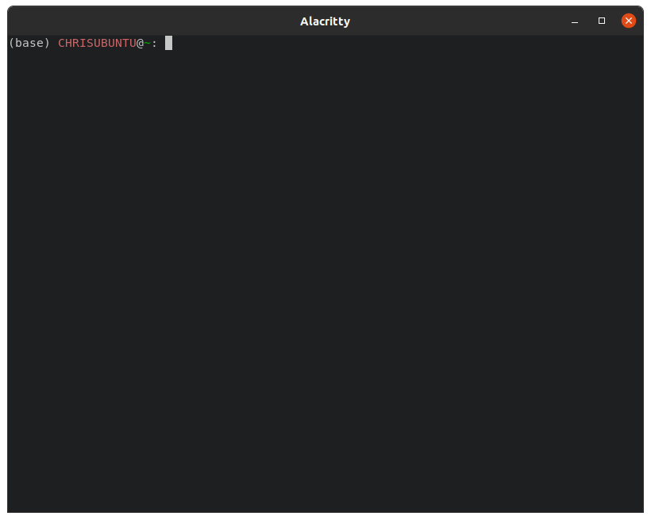

# Detailed Installation
To install hcat, ensure you that **Python Version 3.9** as well as all dependencies properly installed. It is recommended
to use the [Anaconda](https://www.anaconda.com/) distribution of python with a dedicated environment. To do a reccomendned install, 
please use the following steps. 

1) Download the Anaconda distribution of python from the following link: [Anaconda](https://www.anaconda.com/). This will install
python for you! There is **no need** to install python from an additional source. 
2) On Windows, launch the `Anaconda Prompt` application. On Mac or Linux launch a new `terminal`. If installed correctly you 
should see `(base)` to the left of your terminal input.  This is your anaconda `environemnt`.
3) To avoid dependency issues, we will create a new environment to install hcat. This acts like an isolated sandbox where
we can install specific `versions` necessary software. To do this, in the prompt, type `conda create -n hcat python=3.9` and type `y` when asked. 
 This creates an environment to install our software. We must now activate this environment to
access our isolated sandbox and install `hcat`. 
4) To activate our environment, type in the terminal `conda activate hcat`. Notice how `(base)` has been replaced with `(hcat)`.
 
5) To run hcat we first need to install `pytorch`, a deep learning library. To do this, follow the instructions on the
[Pytorch](https://pytorch.org/get-started/locally/) website for your particular system. It is recommended to use these install settings:

| Setting          | Selection                                                |
|------------------|----------------------------------------------------------|
| PyTorch Build    | Stable (1.12.0)                                          |
| Your OS          | Linux/Mac/Windows                                        |
| Package          | Conda                                                    |
| Language         | Python                                                   |
| Compute Platform | CUDA 11.3 (If you have an Nvidia GPU, otherwise use CPU) |

This will create a command to run in the prompt. With these settings, this might look like: `conda install pytorch torchvision torchaudio cudatoolkit=11.3 -c pytorch`.
This may take a while. 

>**NOTE**: Installing pytorch with pip can cause issues in some systems. To ensure GPU capabilities and 
> prevent errors, please install with the package manager `Conda`.

6) Once we've installed pytorch, we can use the command line to install `hcat`. To do this, type `pip install hcat --upgrade`. This command will install all
remaining libraries necessary to run the software into our protected sandbox environment. This means that the software can only be
called from the hcat environment. 

7) If the installation finishes with no errors, we can run `hcat` by simply typing `hcat` in the prompt! 

> **WARNING**: If you restart your prompt or terminal, you will need to reactivate the environment to launch the program. 

