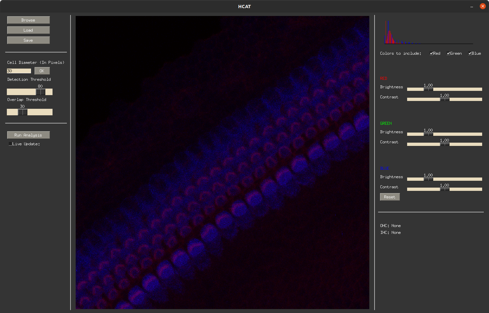

## Use the Detection Gui
We provide an easy to use gui to the performance of hcat's detection capabilites on your own data. To launch the gui and 
analyze your own data, please follow the following steps. 

1) Open a terminal (Mac/Linux) or Anaconda Prompt (Windows) and type: `conda activate hcat`
2) Verify the environment is activated by `(hcat)` being displayed to the left of the input prompt
3) Type `hcat` in the prompt to launch the gui

A gui should launch. 

4) On the top left, click browse to select a file, then load to load the file into the software. The image should be displayed on the screen.

5) Enter the diameter of the cell in pixels. Best measured in ImageJ. Click 'OK'
6) De-select the channels not representing the cell cytosol and hair bundle. 
7) Adjust the brightness and contrast of the image to minimize background fluorescence. 

8) Press 'Run Analysis'. A pretrained model will download off the internet and loaded into the software. This may take a few minutes and should only happen once. 
9) Predictions should appear on screen. Fine tune the predictions by adjusting the cell probability rejection threshold and prediction box overlap threshold.
   
10) Press 'Save' to save the analysis to a CSV and JPG. This will create two new files in the same location as your image called: `<filename>_analysis.csv` and `<filename>_analysis.jpg`
e original file! Beware, subsequent excecutions of this program will overwrite previous analysis files.